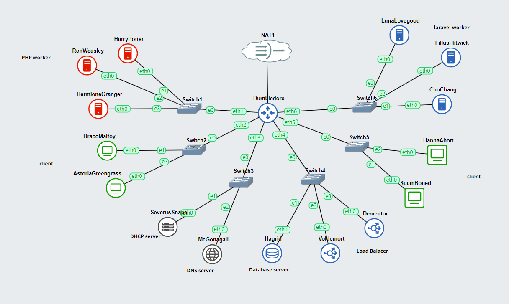
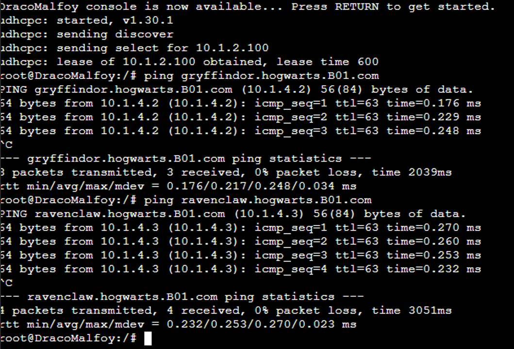
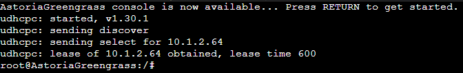
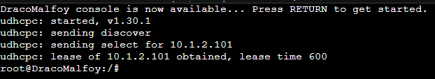
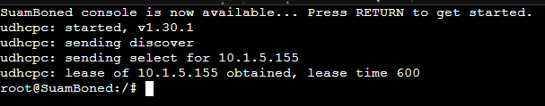
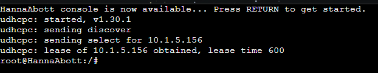
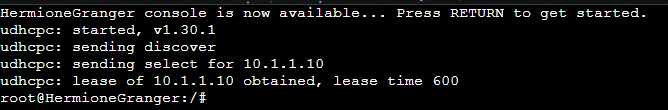
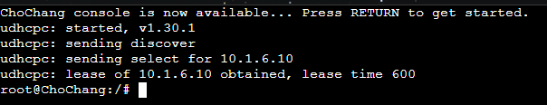
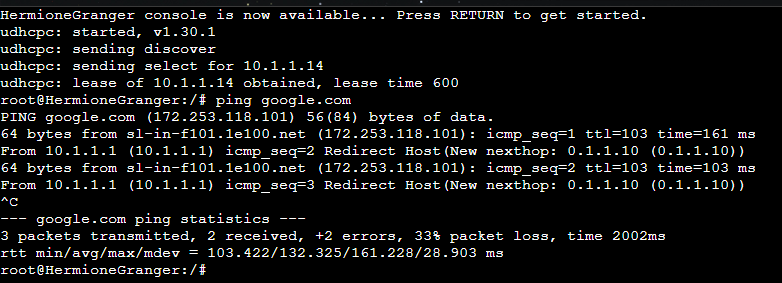
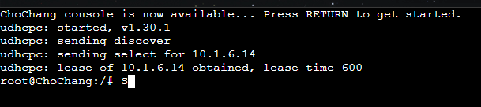

[](https://classroom.github.com/a/1zoHyFGp)
| Name           | NRP        | Kelas     |
| ---            | ---        | ----------|
| Alief Gilang Permana Putra | 5025221193 | Jaringan Komputer (B) |
| Mu'aafii Putra Ramadhan | 5025221135 | Jaringan Komputer (B) |

## Put your topology config image here!



<br>

> Template testing report: https://docs.google.com/document/d/17T0fsnh_4zZTrG-lELDJ88intrc9mkwCzZ_s-23JLCc/edit?usp=sharing

## Put your testing report here! 
> The report is sent in PDF format, uploaded to Drive, and set to public view.

`put the link here`

## Soal 0

> Pada perlombaan akhir tahun kali ini, semua worker dan client ikut serta di dalamnya sebagai perwakilan dari masing-masing asrama. Persiapan yang dilakukan untuk perlombaan ini adalah dengan setup semua network configuration yang sesuai dengan tabel peran diatas. Khusus untuk client menggunakan konfigurasi dari DHCP Server.

> _For the end-of-year competition, all the workers and clients participate, representing their respective houses. The preparation includes setting up the network configuration as per the table above, with clients using DHCP Server configuration_

**Answer**

## Config

- **Dumbledore (DHCP Relay)**
```
auto eth0
iface eth0 inet dhcp
up iptables -t nat -A POSTROUTING -o eth0 -j MASQUERADE -s 10.1.0.0/16

auto eth1
iface eth1 inet static
	address 10.1.1.0
	netmask 255.255.255.0

auto eth2
iface eth2 inet static
	address 10.1.2.0
	netmask 255.255.255.0

auto eth3
iface eth3 inet static
	address 10.1.3.0
	netmask 255.255.255.0

auto eth4
iface eth4 inet static
	address 10.1.4.0
	netmask 255.255.255.0

auto eth5
iface eth5 inet static
	address 10.1.5.0
	netmask 255.255.255.0

auto eth6
iface eth6 inet static
	address 10.1.6.0
	netmask 255.255.255.0
```

- **SeverusSnape (DHCP Server)**
```
auto eth0
iface eth0 inet static
	address 10.1.3.1
	netmask 255.255.255.0
	gateway 10.1.3.0
```

- **McGonagal (DNS Server)**
```
auto eth0
iface eth0 inet static
	address 10.1.3.2
	netmask 255.255.255.0
	gateway 10.1.3.0
```

- **Hagrid (Database)**
```
auto eth0
iface eth0 inet static
	address 10.1.4.1
	netmask 255.255.255.0
	gateway 10.1.4.0
```

- **Voldemort (Load Balancer)**
```
auto eth0
iface eth0 inet static
	address 10.1.4.2
	netmask 255.255.255.0
	gateway 10.1.4.0
```

- **Dementor (Load Balancer)**
```
auto eth0
iface eth0 inet static
	address 10.1.4.3
	netmask 255.255.255.0
	gateway 10.1.4.0
```

- **HarryPotter (PHP Worker)**
```
auto eth0
iface eth0 inet static
	address 10.1.1.1
	netmask 255.255.255.0
	gateway 10.1.1.0
       dns-nameservers 10.1.3.2

hwaddress ether 6a:14:77:9a:af:7b
```

- **RonWeasly (PHP Worker)**
```
auto eth0
iface eth0 inet static
	address 10.1.1.2
	netmask 255.255.255.0
	gateway 10.1.1.0
       dns-nameservers 10.1.3.2

hwaddress ether 1a:ae:d2:7f:e8:91
```

- **HermioneGranger (PHP Worker)**
```
auto eth0
iface eth0 inet dhcp
hwaddress ether 22:fe:8b:15:34:1e
```

## Script sebelum memulai

- Dumbledore (DHCP Relay):

  ```sh
    apt-get update
    apt-get install isc-dhcp-relay -y

    cat <<EOL > /etc/default/isc-dhcp-relay
    SERVERS="10.1.3.1"
    INTERFACES="eth1 eth2 eth3 eth4 eth5 eth6"
    OPTIONS=""
    EOL

    service isc-dhcp-relay restart

    echo "UNCOMMENT 'net.ipv4.ip_forward=1' IN /etc/sysctl.conf!!!!! THEN 'sysctl -p'!!!!"

    echo "Done Dumbledore"
  ```

- SeverusSnape (DHCP Worker):

  ```sh
    echo 'nameserver 10.1.3.2' > /etc/resolv.conf   # Pastikan DNS Server sudah berjalan 
    apt-get update
    apt install isc-dhcp-server -y
  ```

- McGonagall (DNS Worker):

  ```sh
    echo 'nameserver 10.1.3.2' > /etc/resolv.conf
    apt-get update
    apt-get install bind9 -y
  ```

- Hagrid:

  ```sh
    echo 'nameserver 10.1.3.2' > /etc/resolv.conf
    apt-get update
    apt-get install mariadb-server -y
    service mysql start
  ```

- Load Balancer:

  ```sh
    echo 'nameserver 10.1.3.2' > /etc/resolv.conf
    apt-get update
    apt-get install apache2-utils -y
    apt-get install nginx -y
    apt-get install lynx -y

    service nginx start
  ```

- PHP Worker:

  ```sh
  echo 'nameserver 192.173.1.2' > /etc/resolv.conf
  apt-get update
  apt-get install nginx -y
  apt-get install wget -y
  apt-get install unzip -y
  apt-get install lynx -y
  apt-get install htop -y
  apt-get install apache2-utils -y
  apt-get install php

  service nginx start
  service php7.4-fpm start

  ```

- Laravel Worker:

  ```
    Put your configuration here
  ```

- Client:

   ```sh
  apt update
  apt install dnsutils -y
  apt install lynx -y
  apt install apache2-utils -y
  ```

## Soal 1

> Melakukan registrasi subdomain untuk PHP worker bernama gryffindor.hogwarts.yyy.com yang mengarah ke alamat IP load balancer Voldemort dan untuk laravel worker bernama ravenclaw.hogwarts.yyy.com yang mengarah ke alamat IP load balancer Dementor. Seluruh domain ini berkumpul dalam suatu ruang atau folder bernama hogwarts

> _Registering subdomains for the PHP workers named gryffindor.hogwarts.yyy.com, pointing to the IP Voldemort load balancer, and for the Laravel workers named ravenclaw.hogwarts.yyy.com, pointing to the IP Dementor load balancer. All domains are gathered in a folder named "hogwarts."_

**Answer:**

- Screenshot

  

- Configuration

  #### McGonagal (DNS Server)
  ```sh
  #!/bin/bash

    # This script configures McGonagall as the DNS Server (Bind9)

    # Install Bind9
    apt-get update
    apt-get install bind9 -y

    # Configure the zone for hogwarts.B01.com
    echo 'zone "hogwarts.B01.com" {
        type master;
        file "/etc/bind/hogwarts/hogwarts.B01.com";
    };' > /etc/bind/named.conf.local

    # Create directory for zone files
    mkdir -p /etc/bind/hogwarts

    # Create zone files for hogwarts.B01.com
    cp /etc/bind/db.local /etc/bind/hogwarts/hogwarts.B01.com

    # Configure the DNS zone file for hogwarts.B01.com
    echo ';
    ; BIND data file for hogwarts.B01.com
    ;
    $TTL    604800
    @       IN      SOA     ns1.hogwarts.B01.com. admin.hogwarts.B01.com. (
                            2024102201      ; Serial
                            604800         ; Refresh
                              86400         ; Retry
                            2419200         ; Expire
                            604800 )       ; Negative Cache TTL
    ;
    @       IN      NS      ns1.hogwarts.B01.com.
    ns1     IN      A       10.1.3.2        ; McGonagall's IP

    ; Gryffindor subdomain pointing to Voldemort (Load Balancer)
    gryffindor   IN      A       10.1.4.2    ; Voldemort's IP

    ; Ravenclaw subdomain pointing to Dementor (Load Balancer)
    ravenclaw    IN      A       10.1.4.3    ; Dementor's IP
    ' > /etc/bind/sites/hogwarts.B01.com

    # Restart Bind9 to apply the changes
    service bind9 restart

    # Check if Bind9 is running properly
    service bind9 status

    # Verify DNS configuration
    dig gryffindor.hogwarts.B01.com @10.1.3.2
    dig ravenclaw.hogwarts.B01.com @10.1.3.2
  ```

  #### Dementor (Load Balancer)
  ```sh
  #!/bin/bash

  # This script configures Dementor as the Nginx Load Balancer for Ravenclaw

  # Install Nginx
  apt-get update
  apt-get install nginx -y

  # Start and enable Nginx
  service nginx start
  service nginx enable

  # Configure Nginx for Ravenclaw workers
  echo 'upstream ravenclaw_workers {
      server 10.1.6.3;  # LunaLovegood Laravel Worker
      server 10.1.6.2;  # FiliusFlitwick Laravel Worker
      server 10.1.6.1;  # ChoChang Laravel Worker
  }

  server {
      listen 80;
      server_name ravenclaw.hogwarts.B01.com;

      location / {
          proxy_pass http://ravenclaw_workers;
          proxy_set_header Host $host;
          proxy_set_header X-Real-IP $remote_addr;
          proxy_set_header X-Forwarded-For $proxy_add_x_forwarded_for;
          proxy_set_header X-Forwarded-Proto $scheme;
      }
  }' > /etc/nginx/sites-available/ravenclaw.hogwarts.B01.com

  # Enable the site configuration
  sudo ln -s /etc/nginx/sites-available/ravenclaw.hogwarts.B01.com /etc/nginx/sites-enabled/

  # Test and reload Nginx
  service nginx restart

  # Verify if the site is accessible
  curl http://ravenclaw.hogwarts.B01.com
  ```

  #### Voldemort (Load Balancer)
  ```sh
  #!/bin/bash

  # This script configures Voldemort as the Nginx Load Balancer for Gryffindor

  # Install Nginx
  apt-get update
  apt-get install nginx -y

  # Start and enable Nginx
  service nginx start
  service nginx enable

  # Configure Nginx for Gryffindor workers
  echo 'upstream gryffindor_workers {
      server 10.1.1.1;  # HarryPotter PHP Worker
      server 10.1.1.2;  # RonWeasley PHP Worker
      server 10.1.1.3;  # HermioneGranger PHP Worker
  }

  server {
      listen 80;
      server_name gryffindor.hogwarts.B01.com;

      location / {
          proxy_pass http://gryffindor_workers;
          proxy_set_header Host $host;
          proxy_set_header X-Real-IP $remote_addr;
          proxy_set_header X-Forwarded-For $proxy_add_x_forwarded_for;
          proxy_set_header X-Forwarded-Proto $scheme;
      }
  }' > /etc/nginx/sites-available/gryffindor.hogwarts.B01.com

  # Enable the site configuration
  sudo ln -s /etc/nginx/sites-available/gryffindor.hogwarts.B01.com /etc/nginx/sites-enabled/

  # Test and reload Nginx
  nginx -t
  service nginx restart

  # Verify if the site is accessible
  curl http://gryffindor.hogwarts.B01.co
  ```

- Explanation

  `Put your explanation in here`

<br>

## Soal 2

> Memberikan ketentuan khusus untuk DracoMalfoy dan AstoriaGreengrass yang mendapat range IP dari [Prefix IP].2.64 - [Prefix IP].2.65 dan [Prefix IP].2.100 - [Prefix IP].2.101

> Selain itu, untuk HannahAbbott dan SusanBones mendapat range IP dari [Prefix IP].5.50 - [Prefix IP].5.51 dan [Prefix IP].5.155 - [Prefix IP].5.156.


> _Special provisions are given to DracoMalfoy and AstoriaGreengrass, who are assigned the IP range from [Prefix IP].2.64 - [Prefix IP].2.65 and [Prefix IP].2.100 - [Prefix IP].2.101._

> _Additionally, HannahAbbott and SusanBones are assigned the IP range from [Prefix IP].5.50 - [Prefix IP].5.51 and [Prefix IP].5.155 - [Prefix IP].5.156._

**Answer:**

- Screenshot

  
  
  
  

- Configuration

  #### SeverusSnape (DHCP Server)
  ```sh
  #!/bin/bash

  # Update the system and install the ISC DHCP server
  apt-get update
  apt-get install isc-dhcp-server -y


  # Write the new DHCP configuration into /etc/dhcp/dhcpd.conf
  echo 'default-lease-time 600;
  max-lease-time 6000;

  # Subnet for Switch 1 (10.1.1.0/24) - HermioneGranger and other clients
  subnet 10.1.1.0 netmask 255.255.255.0 {
  }


  # Subnet for Switch 2 (10.1.2.0/24) - DracoMalfoy and AstoriaGreengrass
  subnet 10.1.2.0 netmask 255.255.255.0 {
      option routers 10.1.2.1;
      option domain-name-servers 10.1.3.2;
      range 10.1.2.64 10.1.2.65;
      range 10.1.2.100 10.1.2.101;
  }

  subnet 10.1.3.0 netmask 255.255.255.0 {
  }

  subnet 10.1.4.0 netmask 255.255.255.0 {
  }

  # Subnet for Switch 5 (10.1.5.0/24) - HannahAbbott and SusanBones
  subnet 10.1.5.0 netmask 255.255.255.0 {
      option routers 10.1.5.1;
      option domain-name-servers 10.1.3.2;
      range 10.1.5.50 10.1.5.51;
      range 10.1.5.155 10.1.5.156;
  }

  # Subnet for Switch 6 (10.1.6.0/24) - ChoChang and other clients
  subnet 10.1.6.0 netmask 255.255.255.0 {
  }

  # Restart the ISC DHCP server to apply changes
  service isc-dhcp-server restart

  # Check the status of the DHCP server
  service isc-dhcp-server status
  ```

- Explanation

  `Setup DHCP Server untuk pemberian IP. Setelah itu jangan lupa restart server dan relay`

<br>

## Soal 3

> Khusus untuk HermioneGranger yang berada di switch 1 mendapat range IP dari
[Prefix IP].1.10 - [Prefix IP].1.15 dan [Prefix IP].1.20 - [Prefix IP].1.25

> Khusus untuk ChoChang yang berada di switch 6 mendapat range IP dari 
[Prefix IP].6.10 - [Prefix IP].6.15 dan [Prefix IP].6.20 - [Prefix IP].6.25


> _HermioneGranger, who is on switch 1, is assigned the IP range from [Prefix IP].1.10 - [Prefix IP].1.15 and [Prefix IP].1.20 - [Prefix IP].1.25._

> _ChoChang, who is on switch 6, is assigned the IP range from [Prefix IP].6.10 - [Prefix IP].6.15 and [Prefix IP].6.20 - [Prefix IP].6.25._

**Answer:**

- Screenshot

  
  

- Configuration

  #### SeverusSnape (DHCP Server)
  ```sh
  #!/bin/bash

  # Update the system and install the ISC DHCP server
  apt-get update
  apt-get install isc-dhcp-server -y


  # Write the new DHCP configuration into /etc/dhcp/dhcpd.conf
  echo 'default-lease-time 600;
  max-lease-time 6000;

  # Subnet for Switch 1 (10.1.1.0/24) - HermioneGranger and other clients
  subnet 10.1.1.0 netmask 255.255.255.0 {
      range 10.1.1.10 10.1.1.15;
      range 10.1.1.20 10.1.1.25;
      option routers 10.1.1.1;
      option domain-name-servers 10.1.3.2;
  }

  # Subnet for Switch 2 (10.1.2.0/24) - DracoMalfoy and AstoriaGreengrass
  subnet 10.1.2.0 netmask 255.255.255.0 {
      option routers 10.1.2.1;
      option domain-name-servers 10.1.3.2;
      range 10.1.2.64 10.1.2.65;
      range 10.1.2.100 10.1.2.101;
  }

  subnet 10.1.3.0 netmask 255.255.255.0 {
  }

  subnet 10.1.4.0 netmask 255.255.255.0 {
  }

  # Subnet for Switch 5 (10.1.5.0/24) - HannahAbbott and SusanBones
  subnet 10.1.5.0 netmask 255.255.255.0 {
      option routers 10.1.5.1;
      option domain-name-servers 10.1.3.2;
      range 10.1.5.50 10.1.5.51;
      range 10.1.5.155 10.1.5.156;
  }

  # Subnet for Switch 6 (10.1.6.0/24) - ChoChang and other clients
  subnet 10.1.6.0 netmask 255.255.255.0 {
      range 10.1.6.10 10.1.6.15;
      range 10.1.6.20 10.1.6.25;
      option routers 10.1.6.1;
      option domain-name-servers 10.1.3.2;
  }' > /etc/dhcp/dhcpd.conf

  # Restart the ISC DHCP server to apply changes
  service isc-dhcp-server restart

  # Check the status of the DHCP server
  service isc-dhcp-server status
  ```

- Explanation

  `Tambah untuk subnet Hermione dan ChoChang`

<br>

## Soal 4

> Menetapkan batasan waktu untuk DHCP server dalam peminjaman alamat IP untuk client melalui switch 2 selama 5 menit sedangkan client yang melalui switch 5 selama 20 menit. Untuk switch 1 dan switch 6 memiliki batas waktu 10 menit. Alokasi waktu maksimal peminjaman alamat IP selama 100 menit. 

> _The DHCP server's lease time for IP addresses is set as follows: Clients connected through switch 2 have a lease time of 5 minutes, Clients connected through switch 5 have a lease time of 20 minutes, Switches 1 and 6 have a lease time of 10 minutes, The maximum lease time for IP addresses is set at 100 minutes._

**Answer:**

- Screenshot

  
  
  
  
  
  

- Configuration

  #### SeverusSnape (DHCP Server)
  ```sh
  #!/bin/bash

  # Update the system and install the ISC DHCP server
  apt-get update
  apt-get install isc-dhcp-server -y


  # Write the new DHCP configuration into /etc/dhcp/dhcpd.conf
  echo 'default-lease-time 600;
  max-lease-time 6000;

  # Subnet for Switch 1 (10.1.1.0/24) - HermioneGranger and other clients
  subnet 10.1.1.0 netmask 255.255.255.0 {
      range 10.1.1.10 10.1.1.15;
      range 10.1.1.20 10.1.1.25;
      option routers 10.1.1.1;
      option domain-name-servers 10.1.3.2;
      max-lease-time 600;
  }

  # Subnet for Switch 2 (10.1.2.0/24) - DracoMalfoy and AstoriaGreengrass
  subnet 10.1.2.0 netmask 255.255.255.0 {
      option routers 10.1.2.1;
      option domain-name-servers 10.1.3.2;
      range 10.1.2.64 10.1.2.65;
      range 10.1.2.100 10.1.2.101;
      max-lease-time 300;
  }

  subnet 10.1.3.0 netmask 255.255.255.0 {
  }

  subnet 10.1.4.0 netmask 255.255.255.0 {
  }

  # Subnet for Switch 5 (10.1.5.0/24) - HannahAbbott and SusanBones
  subnet 10.1.5.0 netmask 255.255.255.0 {
      option routers 10.1.5.1;
      option domain-name-servers 10.1.3.2;
      range 10.1.5.50 10.1.5.51;
      range 10.1.5.155 10.1.5.156;
      max-lease-time 1200;
  }

  # Subnet for Switch 6 (10.1.6.0/24) - ChoChang and other clients
  subnet 10.1.6.0 netmask 255.255.255.0 {
      range 10.1.6.10 10.1.6.15;
      range 10.1.6.20 10.1.6.25;
      option routers 10.1.6.1;
      option domain-name-servers 10.1.3.2;
      max-lease-time 600;
  }' > /etc/dhcp/dhcpd.conf

  # Restart the ISC DHCP server to apply changes
  service isc-dhcp-server restart

  # Check the status of the DHCP server
  service isc-dhcp-server status
  ```

- Explanation

  `Put your explanation in here`

<br>

## Soal 5

> Memastikan bahwa semua CLIENT, HermioneGranger, dan ChoChang harus menggunakan konfigurasi dari DHCP server, menerima DNS dari Professor McGonagall dan dapat akses internet. Khusus untuk HermioneGranger dan ChoChang mendapatkan IP Statis dari DHCP dengan [Prefix IP].x.14. hint: fixed address


> _Ensure that all CLIENT, HermioneGranger, and ChoChang use DHCP server configurations, receive DNS from Professor McGonagall, and can access the internet. HermioneGranger and ChoChang must receive static IPs from DHCP with the address [Prefix IP].x.14 (hint: fixed address)._

**Answer:**

- Screenshot

  
  

- Configuration

  #### SeverusSnape (DHCP Server)
  ```sh
  #!/bin/bash

  # Update the system and install the ISC DHCP server
  apt-get update
  apt-get install isc-dhcp-server -y


  # Write the new DHCP configuration into /etc/dhcp/dhcpd.conf
  echo 'default-lease-time 600;
  max-lease-time 6000;

  # Subnet for Switch 1 (10.1.1.0/24) - HermioneGranger and other clients
  subnet 10.1.1.0 netmask 255.255.255.0 {
      range 10.1.1.10 10.1.1.15;
      range 10.1.1.20 10.1.1.25;
      option routers 10.1.1.1;
      option domain-name-servers 10.1.3.2;
  }

  # Static IP for HermioneGranger
  host HermioneGranger {
      hardware ethernet 1a:df:19:48:0c:0d;
      fixed-address 10.1.1.14;
  }

  # Subnet for Switch 2 (10.1.2.0/24) - DracoMalfoy and AstoriaGreengrass
  subnet 10.1.2.0 netmask 255.255.255.0 {
      option routers 10.1.2.1;
      option domain-name-servers 10.1.3.2;
      range 10.1.2.64 10.1.2.65;
      range 10.1.2.100 10.1.2.101;
  }

  subnet 10.1.3.0 netmask 255.255.255.0 {
  }

  subnet 10.1.4.0 netmask 255.255.255.0 {
  }

  # Subnet for Switch 5 (10.1.5.0/24) - HannahAbbott and SusanBones
  subnet 10.1.5.0 netmask 255.255.255.0 {
      option routers 10.1.5.1;
      option domain-name-servers 10.1.3.2;
      range 10.1.5.50 10.1.5.51;
      range 10.1.5.155 10.1.5.156;
  }

  # Subnet for Switch 6 (10.1.6.0/24) - ChoChang and other clients
  subnet 10.1.6.0 netmask 255.255.255.0 {
      range 10.1.6.10 10.1.6.15;
      range 10.1.6.20 10.1.6.25;
      option routers 10.1.6.1;
      option domain-name-servers 10.1.3.2;
  }

  # Static IP for ChoChang
  host ChoChang {
      hardware ethernet e6:d5:ae:a1:44:1b;
      fixed-address 10.1.6.14;
  }' > /etc/dhcp/dhcpd.conf

  # Restart the ISC DHCP server to apply changes
  service isc-dhcp-server restart

  # Check the status of the DHCP server
  service isc-dhcp-server status
  ```

- Explanation

  `Put your explanation in here`

<br>

## Soal 6

> Dimulai dari asrama Gryffindor yang menjadi PHP worker, mereka harus melakukan deployment untuk website berikut menggunakan PHP 7.4.

> _The Gryffindor house, represented by the PHP workers, must deploy the following website using PHP 7.4._

**Answer:**

- Screenshot

  `Put your screenshot in here`

- Configuration

  `Put your configuration in here`

- Explanation

  `Put your explanation in here`

<br>

## Soal 7

> Khusus perlombaan ini, Voldemort sudah jinak dan dia menjadi load balancer untuk para penghuni asrama Gryffindor yang menjadi worker PHP. Aturlah agar Voldemort dapat membagi pekerjaan kepada worker PHP secara optimal. Sebagai pengetesan awal, terapkan algoritma round robin dan lakukan test index.php menggunakan apache benchmark dengan 1000 request dan 100 request/second. Lakukan test sebanyak 3 kali lalu hitung rata-rata dan standar deviasi dari time/request

> _Voldemort, who is now reformed, becomes the load balancer for the Gryffindor PHP workers. Optimize Voldemort to distribute tasks to the PHP workers. For the initial test, apply the round-robin algorithm and test it to the index.php page using Apache Benchmark with 1,000 requests and 100 requests/second. Do the test 3 times and calculate the mean and standard deviation of time/request._

**Answer:**

- Screenshot

  `Put your screenshot in here`

- Configuration

  `Put your configuration in here`

- Explanation

  `Put your explanation in here`

<br>

## Soal 8

> Dalam penilaian akhir tahun ini, dibutuhkan algoritma terbaik, cobalah tes 3 algoritma load balancer dengan menggunakan jmeter. Jmeter perlu melakukan login, akses home, dan terakhir logout. Lakukan test dengan 300 thread dan 3 sec ramp up period. Lakukan test sebanyak 3 kali per algoritma, lalu hitung rata-rata dan standar deviasi dari response time. (username: wingardium, password: leviosa)


> _For the final assessment, try three different load-balancing algorithms using JMeter with 300 threads and a 3-second ramp-up period. Jmeter have to be able to login, access homepage, and logout. Do the test 3 times for each algorithm, then calculate the mean and standard deviation of response time. (username: wingardium, password: leviosa)_

**Answer:**

- Screenshot

  `Put your screenshot in here`

- Configuration

  `Put your configuration in here`

- Explanation

  `Put your explanation in here`

<br>

## Soal 9

> Tidak semua IP dapat akses asrama Gryffindor melalui IP Load balancer Voldemort. Untuk itu, berikan akses pada load balancer Voldemort. Autentikasi akan memerlukan username: “jarkom” dan password: “modul3”. Simpan file autentikasi pada  /etc/nginx/secretchamber 

> _Not all IPs can access Gryffindor's house through Voldemort’s load balancer. Grant access to the Voldemort load balancer. Authentication will require username: “jarkom” and password: “modul3”. Save the authentication file in /etc/nginx/secretchamber._

**Answer:**

- Screenshot

  `Put your screenshot in here`

- Configuration

  `Put your configuration in here`

- Explanation

  `Put your explanation in here`

<br>

## Soal 10

> Setelah menambahkan autentikasi ke Gryffindor, coba testing ulang dengan menggunakan JMeter (algoritma round robin) serta skenario, thread, dan ramp up period yang sama seperti no 8 (300 thread, 3 sec ramp up period, login-home-logout). Kali ini, coba juga jumlah worker yang berbeda: 3 worker, 2 worker, dan 1 worker. 

> _After adding authentication to Gryffindor, retest using JMeter (round-robin algorithm) with the same scenario, thread, and ramp up period as number 8 (300 thread, 3 sec ramp up period, login-home-logout). This time, test with different numbers of workers: 3 workers, 2 workers, and 1 worker._

**Answer:**

- Screenshot

  `Put your screenshot in here`

- Configuration

  `Put your configuration in here`

- Explanation

  `Put your explanation in here`

<br>

## Soal 11

> Hogwarts juga bekerjasama dengan ITS dalam perlombaan ini. Untuk itu, setiap request pada Voldemort yang mengandung /informatika pada akhir url akan di proxy passing menuju halaman https://www.its.ac.id/informatika/id/beranda/ 

> _Hogwarts has also partnered with ITS for this competition. Any request to Voldemort containing /informatika at the end of the URL should be proxied to the page at https://www.its.ac.id/informatika/id/beranda/._


**Answer:**

- Screenshot

  `Put your screenshot in here`

- Configuration

  `Put your configuration in here`

- Explanation

  `Put your explanation in here`

<br>

## Soal 12

> Selain butuh autentikasi dalam pengaksesan asrama Gryffindor melalui LB Voldemort, juga perlu dibatasi dengan pembatasan IP.  LB Voldemort hanya boleh diakses oleh client dengan IP [Prefix IP].2.64, [Prefix IP].2.100, [Prefix IP].5.50, dan [Prefix IP].5.155. hint: (fixed in dulu clientnya) 


> _In addition to requiring authentication for access to Gryffindor through Voldemort’s load balancer, IP restrictions also need to be enforced. Voldemort's load balancer can only be accessed by clients with IPs: [Prefix IP].2.64, [Prefix IP].2.100, [Prefix IP].5.50, and [Prefix IP].5.155. (hint: fixed client IPs first)._

**Answer:**

- Screenshot

  `Put your screenshot in here`

- Configuration

  `Put your configuration in here`

- Explanation

  `Put your explanation in here`

<br>

## Soal 13

> Pengaturan database yang dibutuhkan dalam perlombaan ini wajib diatur di Hagrid. Pastikan pengaturan database tersebut dapat diakses oleh Lunalovegood, FiliusFlitwick, dan ChoChang dengan menggunakan username: kelompokyyy dan password: passwordyyy 

> _Database setup for this competition is managed by Hagrid. Ensure that this database can be accessed by LunaLovegood, FiliusFlitwick, and ChoChang using the username: "kelompokyyy" and password: "passwordyyy”_

**Answer:**

- Screenshot

  `Put your screenshot in here`

- Configuration

  `Put your configuration in here`

- Explanation

  `Put your explanation in here`

<br>

## Soal 14

> Selain itu, untuk Lunalovegood, FiliusFlitwick, dan ChoChang memiliki website sesuai dengan https://github.com/lodaogos/laravel-jarkom-modul-3/tree/main  berikut. Jangan lupa melakukan instalasi PHP8.0 dan Composer! Pastikan database di Hagrid sudah ada isinya sekarang dan server Laravel sudah running di localhost!

> _Additionally, LunaLovegood, FiliusFlitwick, and ChoChang have websites following this GitHub link: Laravel Jarkom Modul 3. Install PHP 8.0 and Composer! Make sure Hagrid's data storage is populated, and the Laravel servers are running on localhost!_

**Answer:**

- Screenshot

  `Put your screenshot in here`

- Configuration

  `Put your configuration in here`

- Explanation

  `Put your explanation in here`

<br>

## Soal 15

> Lakukan testing endpoint /register sebanyak 100 request dengan 10 request/second di salah satu worker menggunakan apache benchmark dari SusanBones! Kenapa failed 99x? Jelaskan! 

> _Test the /register endpoint with 100 requests and 10 requests per second on one of the workers using Apache Benchmark from SusanBones! Why did 99 tests fail? Explain!_

**Answer:**

- Screenshot

  `Put your screenshot in here`

- Configuration

  `Put your configuration in here`

- Explanation

  `Put your explanation in here`

<br>

## Soal 16

> Lakukan juga testing pada endpoint /login sebanyak 100 request dengan 10 request/second di salah satu worker menggunakan apache benchmark dari SusanBones! Dapatkan token melalui responsenya juga!

> _Test the /login endpoint with 100 requests and 10 requests per second on one of the workers using Apache Benchmark from SusanBones! Collect the token from the response!_

**Answer:**

- Screenshot

  `Put your screenshot in here`

- Configuration

  `Put your configuration in here`

- Explanation

  `Put your explanation in here`

<br>

## Soal 17

> Coba testing pada endpont /me sebanyak 100 request dengan 10 request/second di salah satu worker menggunakan apache benchmark dari SusanBones! Periksa responsenya apakah sudah sesuai dengan yang diloginkan? 

> _Test the /me endpoint with 100 requests and 10 requests per second on one of the workers using Apache Benchmark from SusanBones! Check if the response matches the logged-in user!_

**Answer:**

- Screenshot

  `Put your screenshot in here`

- Configuration

  `Put your configuration in here`

- Explanation

  `Put your explanation in here`

<br>

## Soal 18

> Mendekati tugas akhir perlombaan ini, mari seimbangkan kekuatan LunaLovegood, FiliusFlitwick, dan ChoChang untuk bekerja sama secara adil! Buatkan load balancer Laravel dengan Dementor dan implementasikan Proxy Bind untuk mengaitkan IP dari ketiga worker tersebut!

> _As the competition nears its end, balance the workload of LunaLovegood, FiliusFlitwick, and ChoChang! Create a Laravel load balancer using Dementor and implement Proxy Bind to link the IPs of the three workers!_

**Answer:**

- Screenshot

  `Put your screenshot in here`

- Configuration

  `Put your configuration in here`

- Explanation

  `Put your explanation in here`

<br>

## Soal 19

> Untuk menguatkan para Laravel Worker, coba implementasikan PHP-FPM pada LunaLovegood, FiliusFlitwick, dan ChoChang. Untuk testing kinerja naikkan: 
pm.max_children
pm.start_servers
pm.min_spare_servers
pm.max_spare_servers
sebanyak tiga percobaan dan lakukan analisis testing menggunakan apache benchmark sebanyak 100 request dengan 10 request/second atau menggunakan jmeter dengan 100 threads! (Pilih 1 metode testing)

> _To strengthen the Laravel workers, implement PHP-FPM on LunaLovegood, FiliusFlitwick, and ChoChang. For performance testing, adjust: pm.max_children, pm.start_servers, pm.min_spare_servers, pm.max_spare_servers. Run the tests three times and analyze the performance by using Apache Benchmark with 100 requests at a rate of 10 requests per second or using JMeter with 100 threads! (Choose 1 testing method)_

**Answer:**

- Screenshot

  `Put your screenshot in here`

- Configuration

  `Put your configuration in here`

- Explanation

  `Put your explanation in here`

<br>

## Soal 20

> Yey terakhir. Menurut Professor Dumbledore, sepertinya menggunakan PHP-FPM tidak cukup untuk meningkatkan performa worker-worker. Implementasikan Least-Conn pada Dementor. Lakukan analisis pada testing kinerja menggunakan apache benchmark sebanyak 100 request dengan 10 request/second atau menggunakan jmeter dengan 100 threads! (Pilih 1 metode testing)

> _Finally, Professor Dumbledore suggests that PHP-FPM might not be enough to improve the workers' performance. Implement the Least-Conn algorithm on Dementor. Analyze the performance by using Apache Benchmark with 100 requests at a rate of 10 requests per second or using JMeter with 100 threads! (Choose 1 testing method)_

**Answer:**

- Screenshot

  `Put your screenshot in here`

- Configuration

  `Put your configuration in here`

- Explanation

  `Put your explanation in here`

<br>
  
## Problems

## Revisions (if any)